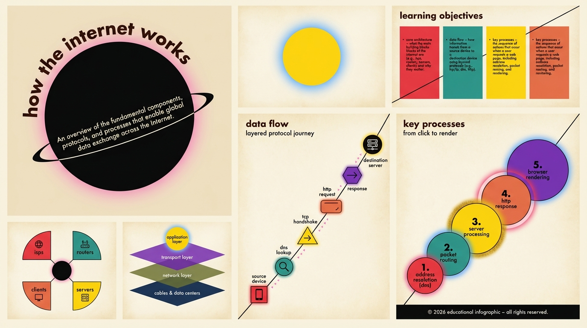
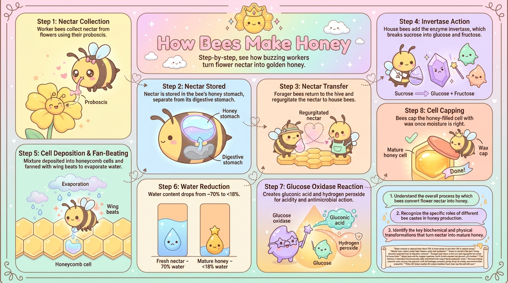
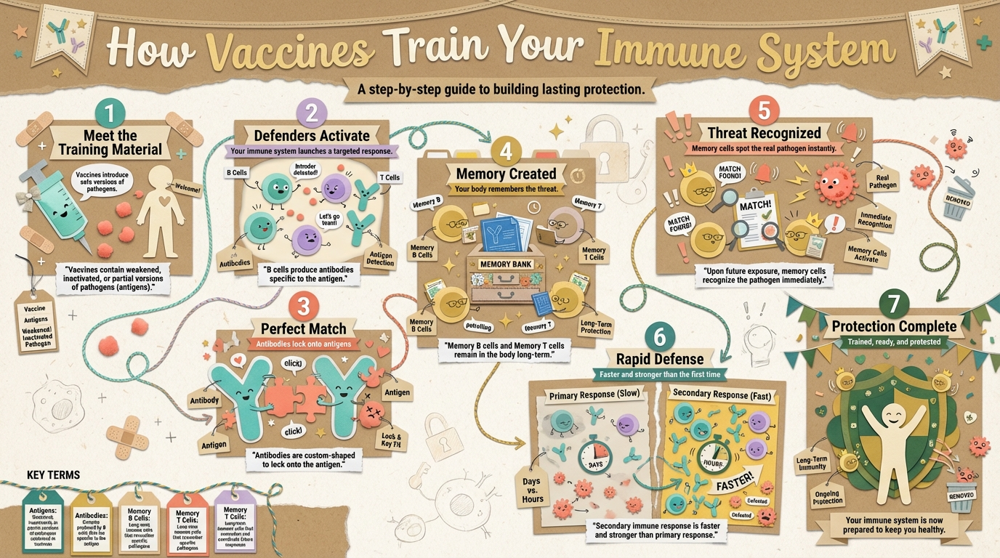
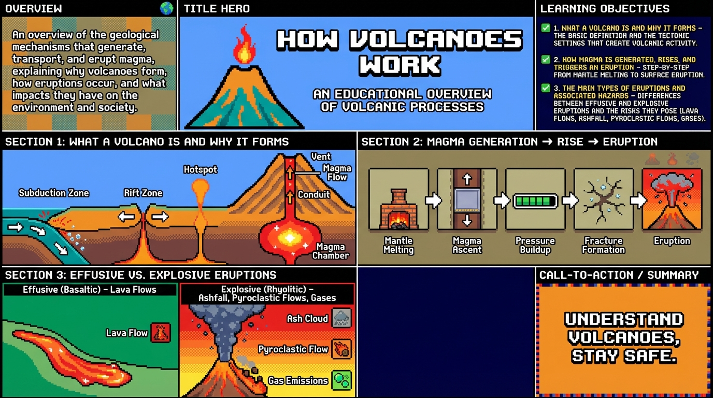
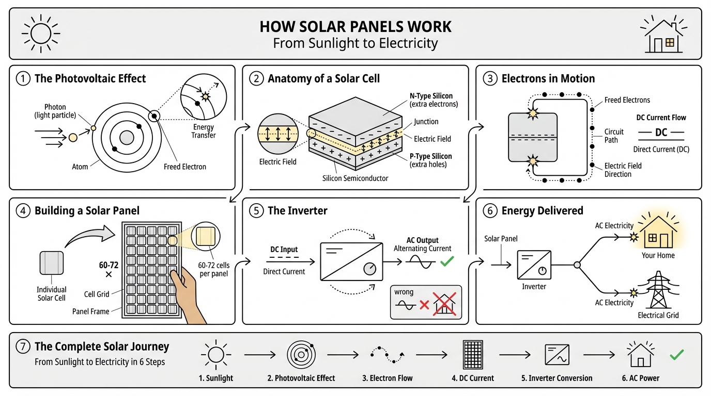
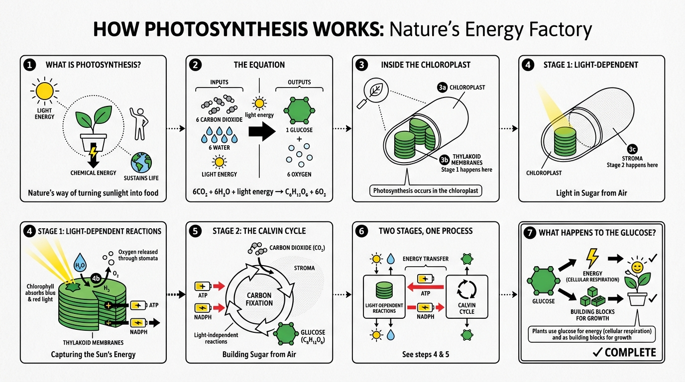
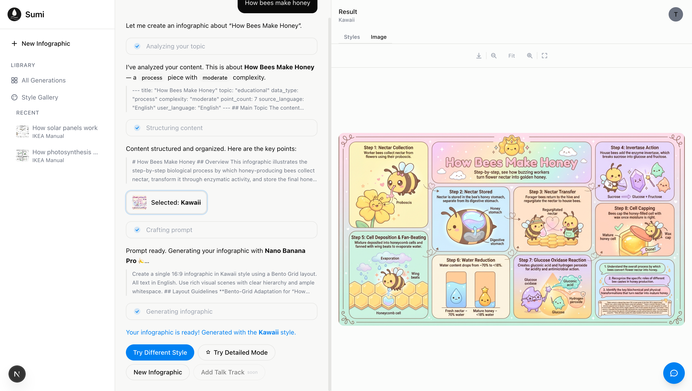
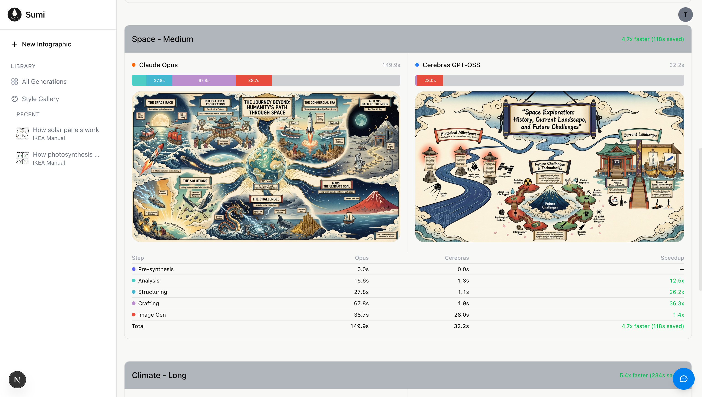

<p align="center">
  <strong>SUMI</strong>
</p>

<h3 align="center">AI-Powered Artistic Infographic Generator</h3>

<p align="center">
  Type a topic. Pick a style. Get an infographic that actually looks like art, not a template.
</p>

<br />

<p align="center">
  
  
</p>
<p align="center">
  
  
</p>

<p align="center">
  <em>Same engine, wildly different styles. From Charley Harper to Kawaii, Bauhaus to Handmade.</em>
</p>

---

## What is Sumi?

Sumi generates artistic infographics from plain text. Give it any topic — "How bees make honey", a 5-page research summary, a meeting transcript — and it produces a visually rich, information-dense infographic in the artistic style of your choice.

It's not a template system. Every infographic is generated from scratch by an AI pipeline that understands your content, organizes it for visual communication, and renders it in one of **57 distinct artistic styles** across **20 layout structures**.

That's over **1,100 possible combinations** — from Ukiyo-e woodblock prints to IKEA assembly manuals, from Pixel Art to Botanical Illustration.

<p align="center">
  
  
</p>
<p align="center">
  
  
</p>

---

## How It Works

Sumi doesn't just throw your text at an image model and hope for the best. A single "generate an infographic" prompt produces garbage. Instead, Sumi uses a **5-step pipeline** where each step has a focused job, a calibrated temperature, and a constrained output format.

```
Topic Text
    │
    ▼
┌─────────────┐     ┌─────────────┐     ┌─────────────┐
│  Synthesize  │────▶│   Analyze    │────▶│  Structure   │
│  (compress)  │     │ (classify &  │     │ (organize    │
│  temp: 0.3   │     │  understand) │     │  sections)   │
└─────────────┘     │  temp: 0.5   │     │  temp: 0.5   │
                    └─────────────┘     └──────┬──────┘
                                               │
                                     ┌─────────▼─────────┐
                                     │  Human Checkpoint  │
                                     │  Pick style +      │
                                     │  layout from 3     │
                                     │  recommendations   │
                                     └─────────┬─────────┘
                                               │
                    ┌─────────────┐     ┌──────▼──────┐
                    │   Generate   │◀────│    Craft     │
                    │   (Gemini)   │     │ (visual      │
                    │              │     │  prompt)     │
                    └─────────────┘     │  temp: 0.7   │
                                        └─────────────┘
```

**Why decomposition matters:** Each step transforms the content further toward visual instructions. The image model never sees your raw text — it receives a carefully crafted scene description with concrete visual elements, spatial relationships, and exact text labels, all in the vocabulary of the chosen artistic style.

<p align="center">
  
</p>

---

## The Pipeline Steps

### 1. Synthesize
Long inputs (>10k characters) are compressed into structured briefs while preserving all data points verbatim. The **Verbatim Rule** is hardcoded: the LLM never "improves" or paraphrases source data.

### 2. Analyze
Content is classified using an instructional design framework — treating infographics as learning tools, not just art. The analyzer identifies content type (timeline, process, comparison, hierarchy), learning objectives, visual opportunities, and complexity level.

### 3. Structure
Analysis is transformed into designer-ready sections with explicit text labels for every element that will appear in the final image. This prevents context explosion — downstream steps receive ~2-3k tokens of organized content, not 10k tokens of raw text.

### 4. Human Checkpoint
The pipeline pauses. Sumi recommends 3 style + layout combinations (best match, creative, accessible) and the user picks one. This single decision point makes the output feel intentional rather than algorithmic.

### 5. Craft
The creative step. The LLM synthesizes the structured content with the chosen style and layout reference documents to produce a rich visual scene description. The key innovation: **Visual Metaphor Mappings** translate abstract concepts into style-specific visual elements (e.g., "Growth" becomes cherry blossoms in Ukiyo-e, upward arrows in Bauhaus, sprouting pixels in Pixel Art).

### 6. Generate
The crafted prompt is sent to Gemini for image generation.

---

## Styles

57 styles spanning art movements, design schools, and illustration traditions:

| Category | Styles |
|----------|--------|
| **Classic Art** | Ukiyo-e, Sumi-e, Shan-Shui, Art Nouveau, Renaissance Diagram |
| **Design Schools** | Bauhaus, De Stijl, Constructivism, Futurism, Memphis |
| **Graphic Design** | Saul Bass, Paul Rand, ISOTYPE, Ligne Claire, Bold Graphic |
| **Illustration** | Charley Harper, Richard Scarry, Dr. Seuss, Storybook Watercolor |
| **Comics & Manga** | Jack Kirby, Golden Age, Osamu Tezuka, Daniel Clowes, Moebius |
| **Contemporary** | Corporate Memphis, Keith Haring, Pop Art, Superflat, Kawaii |
| **Technical** | IKEA Manual, Patent Drawing, Technical Schematic, Knolling, Axonometric |
| **Atmospheric** | Synthwave, Googie, Atomic Age, Chalkboard, Aged Academia |
| **Cultural** | Tibetan Thangka, Rinpa, Día de Muertos, Botanical Illustration |
| **Whimsical** | Pixel Art, Claymation, Origami, Treasure Map, Fantasy Map |

Each style is defined in a ~200-400 line markdown reference with color palettes (hex codes), compositional patterns, typography rules, and visual metaphor mappings.

## Layouts

20 layouts for different content structures:

| Type | Layouts |
|------|---------|
| **Timeline** | Linear Progression, Winding Roadmap, Story Mountain |
| **Hierarchy** | Hierarchical Layers, Tree Branching, Iceberg |
| **Relational** | Hub & Spoke, Venn Diagram, Jigsaw, Bridge |
| **Grid** | Bento Grid, Dashboard, Comparison Matrix, Periodic Table |
| **Flow** | Circular Flow, Funnel, Binary Comparison |
| **Visual** | Comic Strip, Isometric Map, Structural Breakdown |

---

## Fast vs. Detailed Mode

Sumi offers two generation modes with the same pipeline architecture:

| | Fast Mode | Detailed Mode |
|---|-----------|---------------|
| **LLM** | Cerebras GPT-OSS 120B | Claude Opus |
| **Cost per infographic** | ~$0.005 | ~$0.15 |
| **Relative cost** | ~2% | Baseline |
| **Quality** | Good (pipeline compensates) | Superior |

The structured pipeline constrains each LLM's job enough that even a smaller model produces coherent results. Clear roles, explicit output formats, and rich reference documents do the heavy lifting. Claude shines in the creative crafting step; Cerebras is sufficient for analysis and structuring.

<p align="center">
  
</p>

---

## Tech Stack

**Backend** — Python 3.11+ / FastAPI
- LLM clients: Anthropic SDK (Claude), OpenAI-compatible SDK (Cerebras)
- Image generation: Google GenAI SDK (Gemini)
- Database: SQLite with aiosqlite
- Auth: JWE token verification (NextAuth v5 compatible)

**Frontend** — Next.js (App Router) / TypeScript / Tailwind / shadcn/ui
- State: Zustand
- Server state: TanStack React Query
- Auth: NextAuth.js v5
- Animations: Motion

**Deployment** — Railway (two services with private networking)

---

## Local Development

```bash
# Backend
cd backend
python -m venv .venv && source .venv/bin/activate
pip install -e ".[dev]"
uvicorn sumi.main:app --reload

# Frontend
cd frontend
npm install
npm run dev
```

Backend runs on `:8000`, frontend on `:3000`.

### Environment Variables

Create a `.env` at the repo root:

```env
ANTHROPIC_API_KEY=     # Claude (detailed mode)
GOOGLE_API_KEY=        # Gemini (image generation)
CEREBRAS_API_KEY=      # Cerebras (fast mode)
AUTH_SECRET=           # Shared with NextAuth frontend
```

---

## What I Learned Building This

The full writeup lives in [`docs/learnings-models-context-prompting.md`](docs/learnings-models-context-prompting.md). The short version:

1. **Decompose, don't monolith.** A single prompt produces garbage. Five focused steps with calibrated temperatures produce art.

2. **Temperature is a design decision.** 0.3 for extraction (faithful), 0.5 for analysis (balanced), 0.7 for creative synthesis (inventive). The default instinct to keep everything at 0.7 is wrong.

3. **Visual Metaphor Mappings are the secret sauce.** Telling the image model "draw growth" produces nothing. Telling it "draw cherry blossoms emerging from bamboo stalks" (Ukiyo-e) or "draw ascending geometric blocks in primary colors" (Bauhaus) produces art.

4. **Markdown as universal format.** Styles, layouts, analysis frameworks, structured content — everything is markdown. Human-readable, LLM-friendly, parseable, cacheable.

5. **Not every step needs frontier intelligence.** Cerebras at 2% of Claude's cost produces acceptable infographics because the pipeline structure compensates for model capability.

6. **Benchmark before deciding.** We tested FLUX.2 Pro (fast but poor text), Ideogram V3 (mediocre), Recraft V3 (clean text but too diagrammatic) before settling on Gemini. Build comparison tools, don't rely on intuition.

7. **One human decision point changes everything.** Letting the user pick a style makes the output feel intentional rather than algorithmic.

---

## License

MIT
